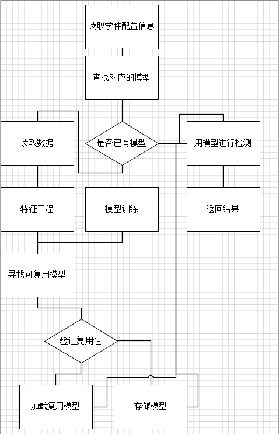
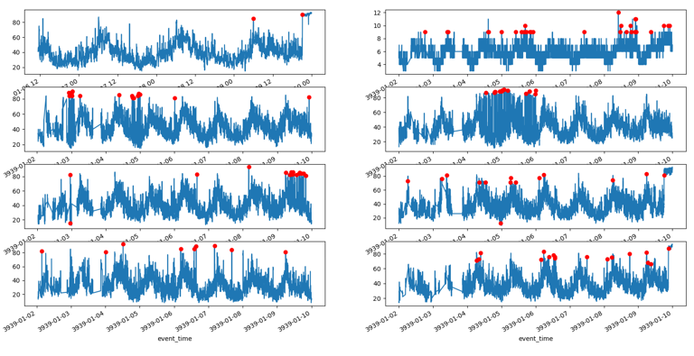

本文主要针对的是主机的监控指标来进行的POC，对于不同的数据类型采用的方案会不尽相同。

# 背景和现状
异常检测已经在北京和四川实施，目前主要通过不同的指标和资源来使用不同的模型来实现异常检测，目前最大的问题是在资源固定的情况下，每多一个指标就需要重启一个场景，这个带来的资源消耗现场无法支撑，需要考虑一种可复用的方式实现不同资源不同指标的异常检测。

# 目前面临的主要问题
* 学件模型的无复用，资源消耗大，现场无法提供那么多资源；而强行合并使用同一模型，很多异常无法发现。
* 学件的生成和优化都需要人工去完成，人工成本高，现场运维无法支撑。
* 异常检测的数据不稳定，容易丢失，丢失后数据补回来，也很难实现对补回数据的异常检测。

# 需要达到的目标
* 学件的模型可以复用，能在现有生产资源下支持百万级指标的异常检测。
* 学件可以根据学件配置自动生成和优化模型。
* 能够通过接口或者临时脚本的方式，实现后补数据的异常检测。

# POC方案
首先限定此次POC的范围，主要针对主机的监控指标进行异常检测，所有效果和数据都是基于上述范围。

由于生产数据的限制，目前使用阿里之前的主机监控数据，相关数据存入10.1.241.165数据库auto-aiops中的machine_table表中，相关数据处理和特征工程等在AutoML的相关章节描述。PS：这里与真实环境不复合的主要是没有使用clickhouse存储数据。

## 学件内的模型复用方案
使用机器学习的算法来实现异常检测，这样即使模型的复用度不高，也尽量减少导出模型的大小从而减少存储空间和数据存取的损耗，同时也减少模型的预测复杂度。

通过模型的效果来评定模型是否可以复用：定义训练数据使用新模型训练的预测结果X，在使用不同已有的模型进行预测，得到结果Xn，使用欧式距离或者余弦相似度去计算X和Xn预测结果相似度，如果相似度达到阈值，认为两个指标可以使用同一模型进行异常检测。

## 学件内的自动训练和优化
引入无监督学习的AutoML方法，实现根据学件配置实现，自动提取训练数据，自动训练，自动更新模型的方法。如下是规划的自动化训练流程图：

如图所示，异常检测的学件通过自动化的训练过程实现模型的创建或者更新，一个学件对应多个模型，每个模型都有确定的指标和资源，在使用模型的时候，也是通过学件的指标和资源来确定模型的。同时模型可以共用机器学习导出的模型，这里存在的风险就是共享模型的更新，可能会影响模型共享（本次POC暂不考虑该风险）。
然后介绍每个步骤的大致方案：
* 读取学件配置，配置里包括学件里的模型更新策略，训练数据获取策略，模型的复用策略等，一般一个学件对应一个指标，这里主要尝试的是单指标异常检测。
* 查找对应模型，可以使用指标名称和资源名称生成的模型名称来查找学件中的模型，如果发现已有可以根据策略进行更新（实验使用每次更新策略），如果未发现模型，则通过模型训练进行更新。
* 读取数据，利用学件中配置的训练数据的sql，从mysql（或者clickhouse）读取数据未后面的模型训练做准备。
* 特征工程，对于主机监控指标的指标，相关指标使用的是时序数据，会使用重采样，将数据对齐到每分钟，同一分钟的数据取平均值，分钟缺失的数据使用bfill填充。这样做的目的是两个一个是去除毛刺，对于分钟内的徒增使用平均达到一定程度的平滑，另外就是对于缺失数据填补（但这种填补可能会增加某个值的数量，所以建议训练数据的缺失值尽量少）；默认使用指标源数据和差分值，这里考虑数据本身的异常和数据突变的异常，但是这对阴涨的异常不敏感（这里建议对于阴涨，使用STL所时序分解，对于trend的变化进行数据增加分析，这种就需要额外的学件）。
* 模型训练，这里使用了孤立森林算法，主要是因为他够“快”，其他的方法还没有尝试。在模型训练里其实应该包括超参选择。一般使用交叉验证，grib搜索，这些都没有用，因为目标还是为了快，这里重点只配置污染率的超参，这个超参通过6sigema来预估异常的数量了近似设定。
* 寻找复用模型，寻找复用模型核心是通过异常检查的效果来判断的。通过不同模型对同一数据进行异常检测，对两个预测结果做向量之间的相似度计算，如果相似度达到阈值认为模型可直接复用。这里相似度的计算使用欧式距离（其实还可以利用余弦相似度），距离小于4的认为是相似的。这里的主要风险就是如果都不相似，需要尝试所有模型，尝试模型总是从第一个开始，这里还可以考虑通过随机方式（还可以通过数据均值，方差等数据特征来选择相似训练集来获取模型），抽取指定数量的模型来减少验证模型的数量。
* 存取文件模型，机器学习的模型会生成pickle文件，存入本地文件，当然也同时使用dict存储缓存中，增加读取速度。

## POC实验报告
如下实现暂时使用笔记本电脑，因为使用的单线程，所以具体笔记本的指标参数暂略。
* 实验一：通过对294个资源的cpu使用率，进行串行的模型训练，一共用时2905秒，一共生成机器学习的模型59个，大约大小33.6M，复用率79.9%，平均每5个资源复用一个模型。
通过资源数量的增加，可能用时成指数增长，需要对模型复用的校验进行优化。模型的复用率较高，整个模型的大小在可接受范围，如果机器学习模型成线性增长，那么百万级别的指标，占用空间大约111G。
* 实验二：对其中8个资源的cpu使用率进行训练，生成4个模型文件，查看具体的异常检测图如下：

由图可知，基本上还是发现了关键的异常点，效果在可接受范围内。具体情况需要做进一步分析。

## 存留问题和未来规划
暂略

##	备注
该方案的POC代码可参照github代码库如下
https://github.com/marvinrencn/auto-aiops.git

具体数据和数据库请参照研发云的mysql数据库
URL("mysql+pymysql", "root", "asiainfo@2019", "10.1.241.165", 3306, "auto-aiops")
